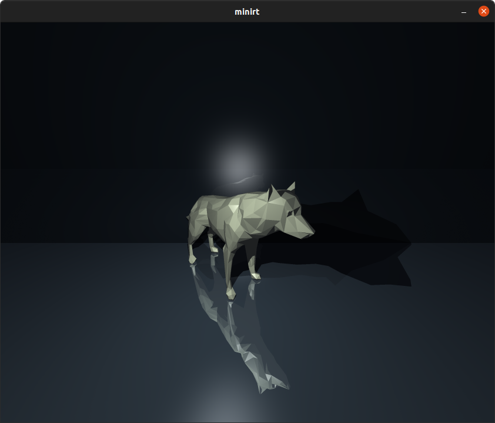
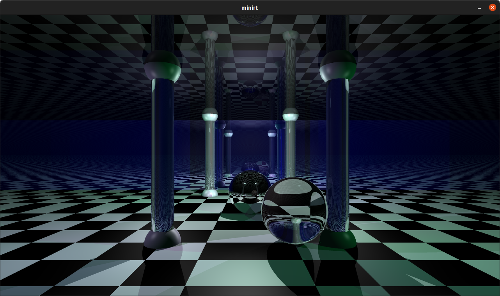
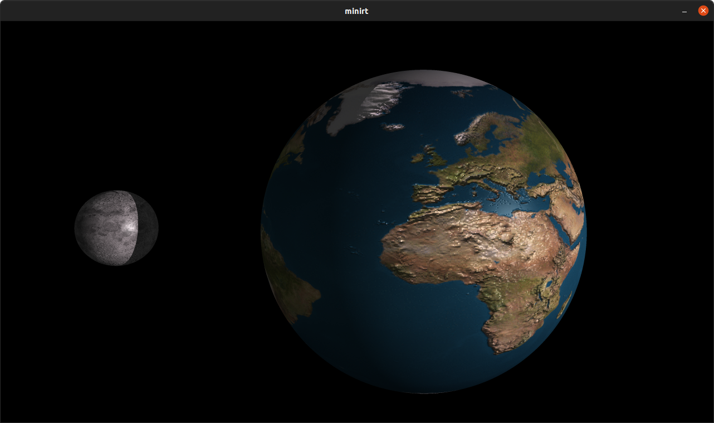
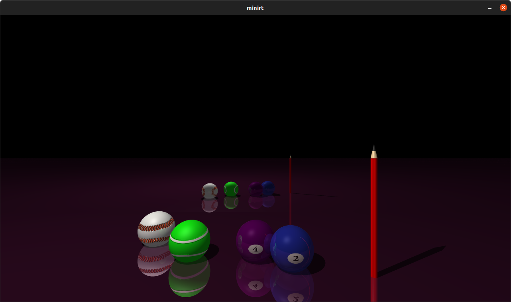
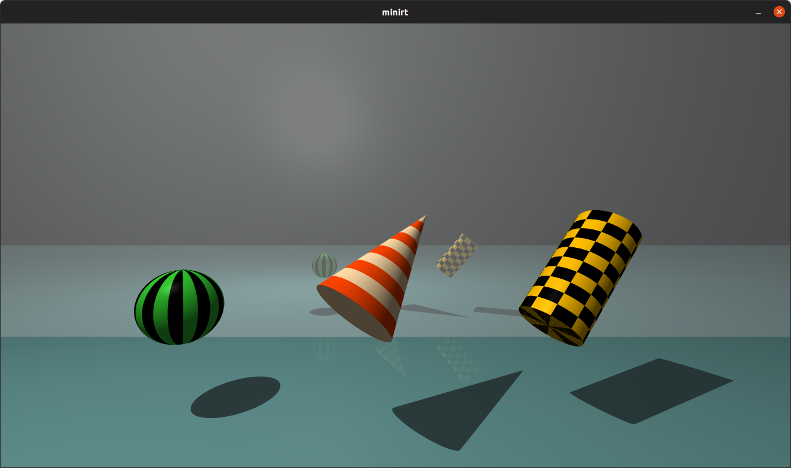
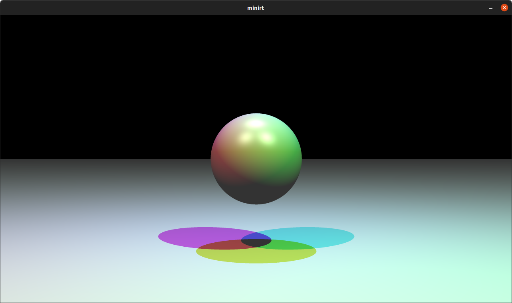
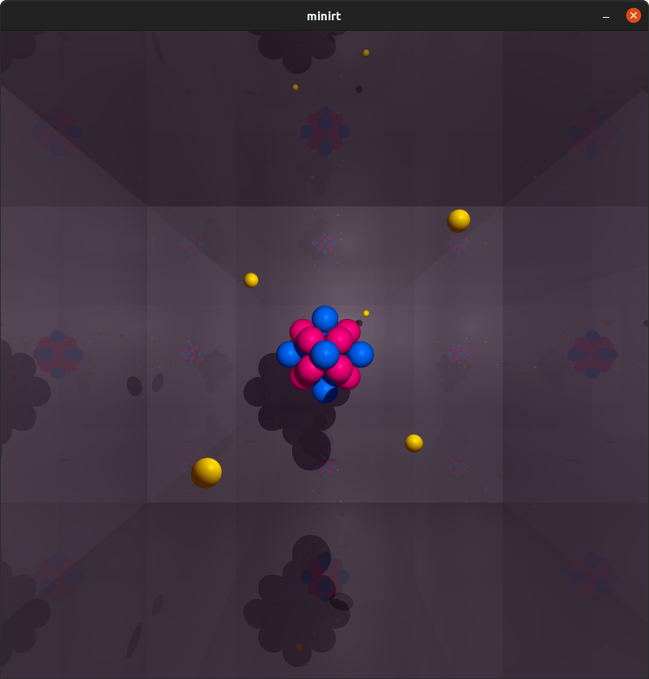

# 42 MiniRT
   [](https://github.com/ricardoreves/42-minirt/actions/workflows/norminette.yml) 

## 🪧 Overview
### Description
This project is an introduction to the beautiful world of Raytracing.
Once completed you will be able to render simple Computer-Generated-Images and you
will never be afraid of implementing mathematical formulas again.
Our first raytracer handle the followings:
* Ambient, diffuse and specular lightning (phong effect)
* Multiple lights colors and intensity
* Simple reflection (does not handle the light reflection)
* Simple refraction (does not handle light source refraction nor inside objects... yet)
* The followings primitive objects : Planes, Spheres, Cylinders, Cones(simple or doubles) and Triangles
* Anti-aliasing (optional)
* Multi-threading (not allowed during the project, but added after)
* Texture map and bump map (only with diffuse lightning, handling on ambient lightning needs to be done)

Possible upgrades coming in a near futur:
* Limit angle on refraction
* Handling of objects inside transparent(refraction) ones
* More primitive objects such as Torus, squares, cubes, pyramides, maybe?
* Better light blending
* Soft shadows

### Goal
The goal of the program is to generate images using the Raytracing protocol. Those computer-generated images will each represent a scene, as seen from a specific angle and position, defined by simple geometric objects, and each with its own lighting system.

## 📷 Preview









## 🚀 Getting Started

### Prerequisites

MiniLibX for Linux requires xorg, x11 and zlib, therefore you will need to install the following dependencies: xorg, libxext-dev and zlib1g-dev. Installing these dependencies on Ubuntu can be done as follows:
```
sudo apt-get update && sudo apt-get install xorg libxext-dev zlib1g-dev libbsd-dev
```

### Installation
1. Clone the project.
```
git clone git@github.com:ricardoreves/42-minirt.git
```
2. Navigate to the project directory.
```
cd 42-minirt
```
3. Compile the MiniRT. (You can ignore the Minilibx compilation warning)
```
make
```

## 🕹 Usage
1. Run the MiniRT with a [scenes](scenes/).
```
./minirt scenes/wolf.rt
```
2. Press key `A` to enable `Antialising`
3. Press key `ESC` to quit 


## 📚 References
The famous and inevitable scratch pixel website - https://www.scratchapixel.com/

The book Fundamentals of Ray Tracing - http://cosinekitty.com/raytrace/raytrace_us.pdf

A few post on slackoverflows, wikipedia pages and other websites such as:

http://graphics.cs.cmu.edu/nsp/course/15-462/Spring04/slides/09-texture.pdf

https://www.ics.uci.edu/~majumder/VC/classes/BEmap.pdf

And what remains of my old studies on vector-based geometry and physics


## 🧰 Tools
- [ImageMagick](https://imagemagick.org/) - Command-line tool to convert, edit, or compose digital images


## 📝 License
Distributed under the MIT License. See [LICENSE](LICENSE) for more information.


